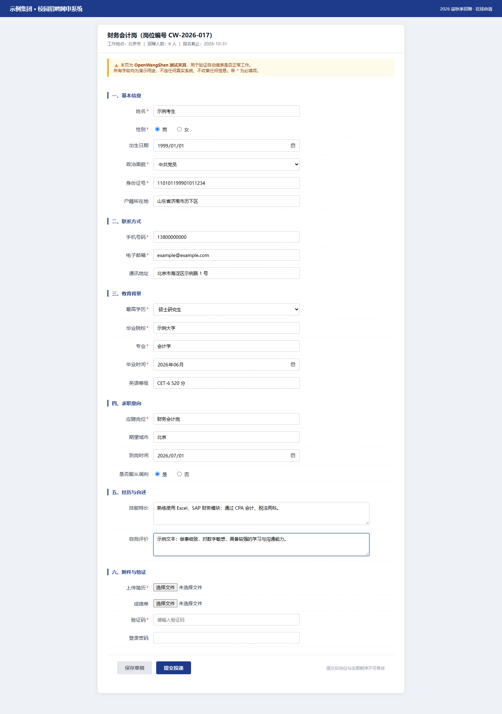

# OpenWangShen · 网申自动填写

> 把「对着空白网申表单逐框敲字」这件事，交给本机脚本。
> 你的身份信息**不出本机**，程序**不替你点提交**。

[English](README.en.md) | 简体中文

---

## 这是什么

一个**跑在你自己电脑上**的网申表单填写工具。它做四件事：

1. **体检** —— 检查你的个人档案有没有写全
2. **开填** —— 打开岗位页，自动识别表单字段，把信息填进去（**不提交**）
3. **清单** —— 打不开页面时，生成一份填写清单，你照着粘
4. **脱敏** —— 需要 AI 帮忙写开放题时，先把身份信息替换掉

**它不是什么：**

- ❌ 不是海投机器。它不替你选岗、不替你投递、不替你提交
- ❌ 不绕过登录、不索取账号密码、不代过人机验证
- ❌ 不联网上传你的任何信息

---

## 效果

下面是用仓库内 `fixtures/模拟网申页.html` 实拍的填写结果：
**22 个字段自动填入，附件 / 验证码 / 密码保持空白**（人工门，程序不碰）。



---

## 解决什么问题

央国企/大厂网申表单通常有 20–40 个字段，其中大量是**重复信息**：
姓名、身份证号、手机号、学校、专业、毕业时间、英语等级……

每投一家就要重敲一遍，敲错一位就可能影响资格。这个工具把这件事变成：

```
填一次档案  →  之后每家只需一条命令
```

---

## 三条红线（设计上不让步）

| # | 红线 | 为什么 |
|---|---|---|
| 1 | **绝不点提交** | 提交不可撤销、占用投递名额。程序填完就停，最后一步永远是你 |
| 2 | **绝不填密码、不碰验证码** | 识别到即标记为「人工门」，程序不触碰 |
| 3 | **身份信息不出本机** | 真值从档案直接写进浏览器或本地文件，**不经过任何网络、不进 AI 上下文** |

---

## 快速开始

### 环境要求

- **Python 3.8+**（体检 / 清单 / 脱敏三个功能**只用标准库**）
- 自动填表另需 `playwright`（可选，缺了会自动降级到清单模式）

```bash
# 自动填表（可选）
pip install playwright
playwright install chromium
```

### 三步走

```bash
# 1. 准备档案：复制示例，改成你自己的信息
cp fixtures/档案_示例.json profile.json

# 2. 体检
python scripts/wangshen.py check --profile profile.json

# 3. 填表（建议先 --dry-run 看能不能识别字段）
python scripts/wangshen.py fill --profile profile.json \
    --url "https://某公司招聘页" --dry-run
python scripts/wangshen.py fill --profile profile.json \
    --url "https://某公司招聘页" --screenshot filled.png
```

不确定怎么走？打印使用路径：

```bash
python scripts/wangshen.py guide
```

---

## 工作原理

```
profile.json（你的档案，只在本机）
        │
        ├─→ 体检 ──────────→ 缺什么字段
        │
        ├─→ 字段映射 ──────→ 页面标签 → 档案键（本地规则库，56 字段 / 240 标签）
        │                       │
        ├─→ 自动填表 ←─────────┘  真值直接写进浏览器
        │      └─ 打不开？→ 生成《填写清单》→ 你照着粘
        │
        └─→ 脱敏通道 ──────→ 需要 AI 帮忙时，PII 先换成占位符
```

**关键设计**：填表是机械动作，不需要"思考"。所以真值可以不过 AI；
而需要"思考"的任务（写开放题、优化描述）反而不需要真值。
**这两件事天然可以分开** —— 这就是本工具隐私设计的地基。

---

## 目录结构

```
OpenWangShen/
├── scripts/
│   ├── core.py            核心库：规则加载 / 标签索引 / 字段映射
│   ├── check_profile.py   档案体检
│   ├── fill_form.py       自动填表（playwright）
│   ├── make_sheet.py      填写清单生成（保底模式）
│   ├── mask_pii.py        PII 脱敏通道
│   └── wangshen.py        统一入口
├── assets/
│   └── 字段规则_通用.json   字段知识库（56 字段 / 240 标签）
├── fixtures/              测试夹具（示例档案 / 模拟网申页）
├── examples/              示例产物
├── tests/                 单元测试
└── docs/                  详细文档
```

---

## 命令参考

| 命令 | 作用 |
|---|---|
| `wangshen.py check --profile p.json` | 档案体检（必填项缺失会提示） |
| `wangshen.py fill --profile p.json --url U [--dry-run]` | 自动填表，`--dry-run` 只映射不写入 |
| `wangshen.py sheet --profile p.json --labels-file L.txt` | 生成填写清单 |
| `wangshen.py mask --profile p.json --in a.txt --out b.txt` | PII 脱敏 |
| `wangshen.py mask --profile p.json --in b.txt --out c.txt --restore` | 还原 |
| `wangshen.py selftest` | 全部自测 |
| `wangshen.py guide` | 打印使用路径 |

**常用选项**

| 选项 | 说明 |
|---|---|
| `--channel msedge\|chrome` | 用哪个浏览器内核（默认 msedge） |
| `--proxy http://127.0.0.1:端口` | 浏览器代理。**Chromium 不读环境变量，必须显式传** |
| `--headed` | 显示浏览器窗口（默认无头） |
| `--screenshot 路径` | 截图留存 |

---

## 常见问题

**Q：真值真的不进 AI 上下文吗？**
是。填表脚本从档案取值后直接写进浏览器，终端只打印「字段名 + 就绪/缺项」，
**不打印任何值**。清单模式同理，值只写进本地文件。

**Q：为什么 `--dry-run` 很有用？**
它只做映射不写入，能提前看出「这个页面哪些字段识别不了」。
识别不了的字段不会被瞎猜，会如实列出来。

**Q：浏览器打不开页面怎么办？**
最常见的原因是代理。Chromium 系浏览器**不读 `HTTP_PROXY` 环境变量**，
需要显式传 `--proxy`。另外，打不开不是死路 —— 用 `sheet` 子命令生成清单即可。

**Q：填错了怎么办？**
`--dry-run` 先跑一遍。另外程序**永远不提交**，你有充分时间核对。

**Q：支持哪些招聘系统？**
任何标准 HTML 表单都可以尝试。字段识别靠 `assets/字段规则_通用.json`
的标签匹配，**未命中的字段会交给你手填，不会瞎猜**。
遇到识别不了的字段，欢迎提 Issue 或直接补规则库（见 CONTRIBUTING）。

---

## 隐私说明

- `profile.json` 只存放于本机。`.gitignore` 已屏蔽相关文件名，**请勿提交**
- 脱敏采用**白名单**策略：只替换「能唯一定位到某个人」的字段
  （姓名/手机号/身份证/邮箱/地址…）。
  「性别=男」「政治面貌=党员」**不替换** —— 它们定位不到人，脱了反而让文本没法用
- 脱敏后会自动做**二验**：再扫一遍确认无残留，未通过则拒绝输出
- 映射表只在内存里存活一次，**不落盘、不写日志**

详见 [docs/隐私设计.md](docs/隐私设计.md)。

---

## 免责声明

- 本工具只做**表单填写**，不保证任何投递结果
- 请遵守目标网站的服务条款。使用本工具产生的后果由使用者自行承担
- **投递前请务必核对**填写内容，尤其是身份证号、手机号等关键字段

---

## 许可

[MIT](LICENSE)

---

## 作者

**liyang** · 微信：`liyang7078`

遇到字段识别失败、或者想补充规则，欢迎直接提
[Issue](../../issues) 或 [Pull Request](../../pulls)；也欢迎加微信交流。
